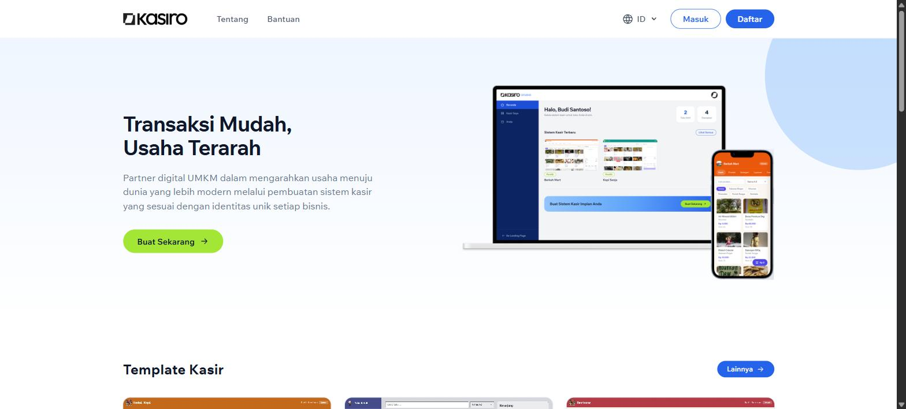
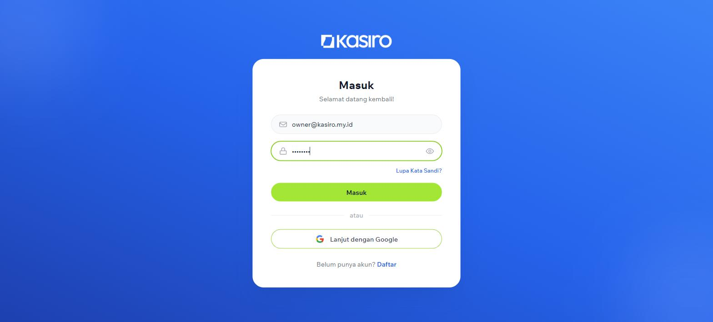
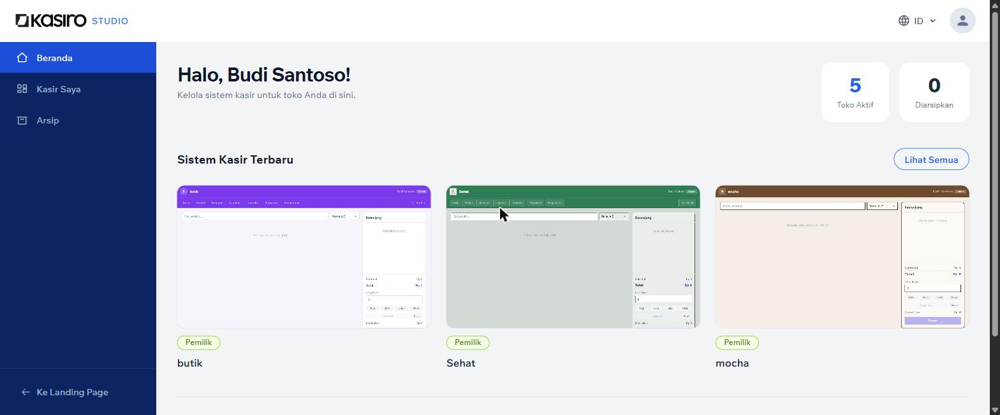
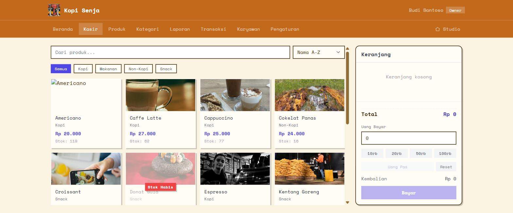
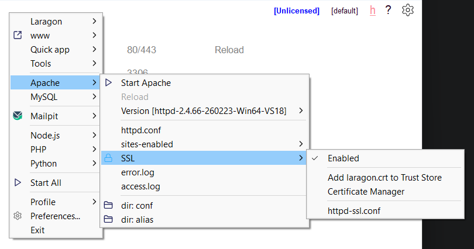

# Kasiro

Kasiro adalah platform SaaS multi-tenant untuk membuat sistem kasir (POS) bermerek untuk UMKM. Setiap toko yang dibuat lewat "studio" mendapat subdomain sendiri (`{namatoko}.kasiro.my.id`), lengkap dengan template tampilan, tema warna, dan kini juga bahasa yang bisa disesuaikan per toko.

<p align="center">
  
</p>

<p align="center">
  
  
  
</p>

## Tech Stack

- **Backend:** Laravel 12, PHP 8.3
- **Frontend:** Blade + Alpine.js + Tailwind CSS (Vite)
- **Database:** MySQL
- **Screenshot generator:** Spatie Browsershot (Puppeteer/headless Chrome)
- **Auth:** Laravel Breeze + Google OAuth (Socialite) + 2FA (Google2FA)

## Fitur Utama

- **Multi-tenancy berbasis subdomain** — domain pusat (`kasiro.my.id`) untuk studio, subdomain per tenant untuk toko masing-masing.
- **Sistem template & tema** — 6 template kasir siap pakai (2 per tema: classic, modern, retro), preview screenshot otomatis via headless Chrome.
- **Localization (id/en)** — Indonesia sebagai bahasa default, English sebagai bahasa kedua. Bahasa studio dan bahasa tiap tenant bisa berbeda; tenant bisa memilih ikut bahasa studio (dinamis) atau bahasa sendiri.
- **Kasir (POS)**, manajemen produk & kategori, laporan, manajemen karyawan & undangan, arsip toko.
- **Login Google + 2FA** untuk keamanan akun studio.

## Setup Lokal

Pengembangan lokal **wajib menggunakan Laragon** dan **Acrylic DNS Proxy** (Acrylic UI) karena aplikasi Kasiro berbasis multi-tenant dengan *wildcard subdomain* (`*.kasiro.test`).

### 1. Konfigurasi DNS Wildcard (Acrylic UI & Network Settings)

Karena file `hosts` default Windows tidak mendukung wildcard domain (`*.kasiro.test`), kita perlu menggunakan **Acrylic DNS Proxy**.

#### Step A: Pengaturan Host di Acrylic UI
1. Buka **Acrylic UI** (atau edit file `AcrylicHosts.txt`).
2. Tambahkan baris konfigurasi wildcard berikut di bagian pengaturan host Acrylic:
   ```text
   127.0.0.1 *.kasiro.test
   ```
3. Simpan file dan restart layanan Acrylic DNS Proxy.

#### Step B: Pengaturan Network Adapter Windows ("View Network Connections")
1. Buka **View Network Connections** di Windows (tekan `Win + R`, ketik `ncpa.cpl`, lalu tekan Enter).
2. Klik kanan pada Network Adapter yang sedang aktif (misalnya **Wi-Fi** atau **Ethernet**) -> pilih **Properties**.
3. Pilih **Internet Protocol Version 4 (TCP/IPv4)** -> klik **Properties**.
4. Pilih **"Use the following DNS server addresses"**:
   - **Preferred DNS server:** `127.0.0.1`
   - **Alternate DNS server:** `8.8.8.8` (atau `1.1.1.1`)
5. Klik **OK** dan jalankan perintah flush DNS di Command Prompt / Terminal:
   ```cmd
   ipconfig /flushdns
   ```

---

### 2. Konfigurasi Virtual Host & SSL Laragon (Apache)

Aplikasi wajib dijalankan di web server Laragon (Apache) agar VirtualHost mendengarkan domain utama `kasiro.test` dan seluruh subdomain `*.kasiro.test` via HTTP (port 80) & HTTPS (port 443).

#### Step A: Konfigurasi VirtualHost
1. Buka folder konfigurasi VirtualHost Laragon (misalnya di `T:/Programs/laragon/etc/apache2/sites-enabled/auto.kasiro.test.conf`).
2. Buat atau sesuaikan isi file `auto.kasiro.test.conf` dengan konfigurasi berikut:

   ```apache
   define ROOT "T:/Programs/laragon/www/kasiro/public"
   define SITE "kasiro.test"

   <VirtualHost *:80> 
       DocumentRoot "${ROOT}"
       ServerName ${SITE}
       ServerAlias *.${SITE}
       <Directory "${ROOT}">
           AllowOverride All
           Require all granted
       </Directory>
   </VirtualHost>

   <VirtualHost *:443>
       DocumentRoot "${ROOT}"
       ServerName ${SITE}
       ServerAlias *.${SITE}
       <Directory "${ROOT}">
           AllowOverride All
           Require all granted
       </Directory>

       SSLEngine on
       SSLCertificateFile      T:/Programs/laragon/etc/ssl/laragon.crt
       SSLCertificateKeyFile   T:/Programs/laragon/etc/ssl/laragon.key
    
   </VirtualHost>
   ```

#### Step B: Aktivasi SSL & Trust Certificate pada Laragon
Untuk mengaktifkan koneksi HTTPS yang valid tanpa peringatan keamanan browser:

<p align="center">
  
</p>

1. Buka panel Laragon, klik kanan area kosong atau buka menu **Menu**.
2. Arahkan ke **Apache** -> **SSL** -> Centang **Enabled**.
3. Klik opsi **Add laragon.crt to Trust Store** (konfirmasi `Yes`/`Ya` apabila muncul prompt Windows Security Warning agar sertifikat SSL Laragon dianggap valid dan dipercayai oleh sistem Windows/browser).
4. Restart Apache pada panel Laragon (**Stop** -> **Start All**).

---

### 3. Setup Project Laravel

1. Clone repo, lalu install dependency backend dan frontend:
   ```bash
   composer install
   npm install
   ```
2. Salin `.env.example` menjadi `.env`, lalu generate `APP_KEY`:
   ```bash
   cp .env.example .env
   php artisan key:generate
   ```
3. Pastikan konfigurasi domain pada `.env` sudah sesuai:
   ```env
   APP_URL=http://kasiro.test
   TENANCY_CENTRAL_DOMAIN=kasiro.test
   ```
4. Sesuaikan koneksi database (`DB_*`) di `.env`, lalu buat databasenya di MySQL/Laragon.
5. Jalankan migration dan seeder (menyiapkan 6 template awal dan akun demo `owner@kasiro.my.id` / `password` dengan tenant `kopisenja` & `berkahmart`):
   ```bash
   php artisan migrate --seed
   php artisan storage:link
   ```
6. Jalankan Vite dev server untuk frontend:
   ```bash
   npm run dev
   ```
7. Buka browser dan akses:
   - Central App / Studio: `https://kasiro.test`
   - Tenant Demo 1: `https://kopisenja.kasiro.test`
   - Tenant Demo 2: `https://berkahmart.kasiro.test`
8. (Opsional) Generate ulang screenshot template/tenant jika membutuhkan preview gambar:
   ```bash
   php artisan templates:screenshots --queue
   php artisan tenants:screenshots
   php artisan queue:work   # perlu dijalankan supaya job screenshot diproses
   ```